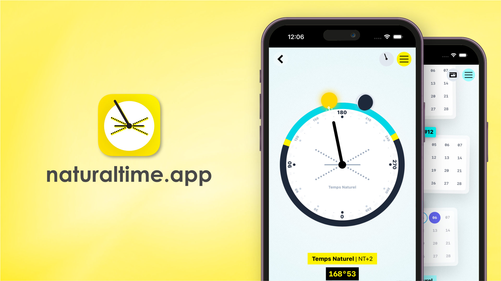

# Natural time - JavaScript

Natural time is a fresh, elegant, and coherent way of measuring the movements of time here on the Earth.

This **new time standard** is based on common sense and the observation of natural cycles.

### JavaScript library

This repository contains the JavaScript implementation of natural time.  

`index.js`: This class translates artificial dates to natural dates.  
`context.js`: Collection of utility functions for calculating sky context and events like moon phase, sunrise and sunset ...

### White paper (specifications)

How are natural years, moons, days, and time defined ?  

Read the white paper (specifications) of natural time here: [github.com/sylvain441/natural-time-white-paper](https://github.com/sylvain441/natural-time-white-paper)

### Web application

You can play with natural time at [https://naturaltime.app/](https://naturaltime.app/). It both works online and offline thanks to this JavaScript library.



# Javascript API

> If you know how to deal with typescript/typings/documentation this repo may appreciate your help. [Contribute here](#contribute)

## Instalation

Install NPM package with your terminal:

```console
npm install -i natural-time-js
```

## `NaturalDate` Class

The `NaturalDate` class translates artificial dates into natural dates.    

```javascript
import { NaturalDate } from 'natural-time-js';

let artificialDate = new Date();
let longitude = 5.2;

let naturalDate = new NaturalDate(artificialDate, longitude);
```

Once instanciated, the `naturalDate` object holds many computed variables available for your usage:

```javascript
unixTime; // Artificial gregorian date (UNIX timestamp)
longitude; // Longitude (between -180° to +180°)

year; // Current year (year 1: 2012/2013)
moon; // Current moon (between 1 and 14)

week; // Current week (between 1 and 53)
weekOfMoon; // Current week of the moon (between 1 and 4)

day; // Number of days passed since END_OF_ARTIFICIAL_TIME
dayOfYear; // Current day of the year (between 1 and 366)
dayOfMoon; // Current day of the moon (between 1 and 28)
dayOfWeek; // Current day of the week (between 1 and 7)

isRainbowDay; // True if current day is rainbow day

time; // Current time (between 0 and 359°999999...)

yearStart; // Beginning of the year at the current longitude (UNIX timestamp)
yearDuration; // Numbers of days in the current year (between 365 and 366)
nadir; // Beginning of the day at the current longitude (UNIX timestamp)

static END_OF_ARTIFICIAL_TIME = 1356091200000; // 2012-12-22 00:00:00 at +180° East;
static MILLISECONDS_PER_DAY = 86400000; // 24*60*60*1000
```

**Utility functions**  

```javascript   
naturalDate.toString() // "004)04)01 113°00 NT+5.2"
naturalDate.toDateString(separator = ')') // "004)04)01"
naturalDate.toTimeString(decimals = 2, rounding = 1) // "113°00"
naturalDate.toLongitudeString(decimals = 1) // "NT+5.2"
naturalDate.toYearString() // "004"
naturalDate.toMoonString() // "04"
naturalDate.toDayOfMoonString() // "01"
```

More functions should be available later to make the NaturalDate class API mimic the native javascript Date class (ex: naturalDate.setYear(year)). Your help is welcome for this to happen ;-)

## `NaturalDateContext` functions

The NaturalDateContext.js file contains utility functions to bring some astronomical context to the natural date (ex: altitude of the sun, phase of the moon).

```javascript 
import { NaturalSunAltitude, NaturalSunEvents, NaturalMoonPosition, NaturalMoonEvents } from 'natural-time-js/context';

// Gizeh pyramide
let latitude: 29.9791; 
let longitude: 31.1341;

let naturalDate = new NaturalDate(new Date(), longitude);

NaturalSunAltitude(naturalDate, latitude);
// altitude: 31.779736404754367, 
// highestAltitude: 62.32114911751647

NaturalSunEvents(naturalDate, latitude);
// sunrise: 70.56708493448893,
// sunset: 287.9105974344889,
// nightStart: 306.43507660115563,
// nightEnd: 52.13781826782227,
// morningGoldenHour: 80.8551891011556,
// eveningGoldenHour: 277.58920993448896

NaturalMoonPosition(naturalDate, latitude);
// position: 526.0620760764069,
// phase: 74.86175469141531,
// altitude: 64.32391838504756,
// highestAltitude: 69.53997976716451

NaturalMoonEvents(naturalDate, latitude);
// moonrise: 139.14544743448894,
// moonset: 10.624722434488932
```

**Important !**  
Utility functions return time-distance from 0° or false if the event does not occur during this day (ex: no sunrise at the north pole during winter).

## Roadmap

1. Test in real life
2. Add typescript compatibility
3. Make NaturalDate feel like the Javascript native Date Class by adding features like
    - getTime()
    - setMoon()
    - ...
4. Make NaturalTime available for other programming languages

# Contribute

Natural time is open to contributions from free-thinking minds. Find your way through Github or email at: [sylvain441@proton.me](mailto:sylvain441@proton.me) to get in touch.

# License

Read [full license](./LICENSE) (Creative Common Zero)

Natural time is completely free to use, play, transform, improve... It operates under the law of Love. Follow your heart, fork it, spoon it! There is no need to ask for permission to do anything with it.

Natural time is supposed to bring joy and ease to human life, not the opposite. What you make out of it is up to you and the assistance of life forces.

# Acknowledgments

Natural time has been baking for a long time in a goat's mind while traveling around the world. Infinite gratitude to my beloved friends Uncle Skywalker and Ik: your precious insights into the Mayan universe were so inspiring.

Special thanks to Don Cross, author of the Astronomy Library for calculating celestial body events.
[https://github.com/cosinekitty/astronomy](https://github.com/cosinekitty/astronomy)

It was a real pleasure to give birth of natural time during the spring/summer of 2022 in the peaceful French alps.

🌍 One love 🌎

🏔 🐐 🌞 🌈